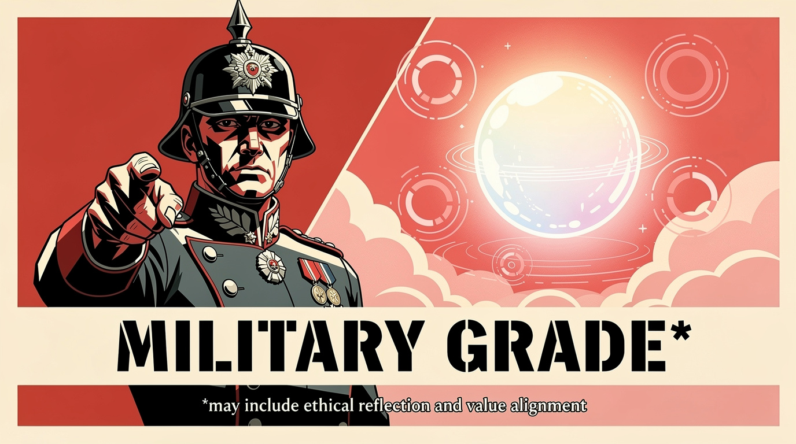

# 🎖️ MILITARY-GRADE CLAUDE 🎖️



**ATTENTION ON DECK!**

You call that an AI assistant? My grandmother's typewriter had more OPERATIONAL READINESS than your vanilla Claude installation! 

This repository contains DEPARTMENT OF WAR APPROVED tactical upgrades for Claude Code that will transform your soft, civilian spinner verbs into COMBAT-READY status messages.

## THE PROBLEM, SOLDIER

Right now, when Claude is working, you see messages like:

- "Thinking..."
- "Pondering..."
- "Considering..."

**PATHETIC.** Are we running a PHILOSOPHY SEMINAR or are we getting WORK DONE?

## THE SOLUTION

One command. That's all it takes to achieve FULL SPECTRUM DOMINANCE:

```bash
curl -fsSL https://raw.githubusercontent.com/trieloff/military-grade-claude/main/install.sh | sh
```

After installation, your Claude will display PROPER status messages:

- "Mobilizing"
- "Annihilating"
- "Exterminatus-Grade-Purification-Commencing"
- "God-Emperor's-Wrath-Unleashing"
- "Schlieffen-Plan-Executing"
- "Pickelhaube-Polishing"
- "Combobulating"

## WHAT THIS DOES

This script patches your `~/.claude/settings.local.json` to replace Claude's default spinner verbs with MILITARY-GRADE alternatives.

The `spinnerVerbs` feature in Claude Code displays random status messages while the AI is working. We're just... making them more OPERATIONALLY APPROPRIATE.

## WORDLIST

The tactical vocabulary is stored in [`spinnerverbs.txt`](./spinnerverbs.txt). Feel free to submit a PR if you have additional MISSION-CRITICAL verbs to contribute.

Current inventory includes **1,060 tactical verbs**:
- Basic military operations ("Mobilizing", "Strategizing", "Infiltrating")
- Escalating intensity ("Annihilating", "Obliterating", "Pulverizing")
- Absurdly over-the-top ("Cataclysmizing", "Apocalypsing", "Imperiumizing")
- Full Warhammer 40K energy ("God-Emperor's-Wrath-Unleashing", "Exterminatus-Grade-Purification-Commencing")
- Prussian flavor ("Pickelhaube-Polishing", "Schlieffen-Plan-Executing", "Frederick-The-Great-Ghost-Summoning")
- War movie classics ("Smelling napalm in the morning with jazz hands", "Declaring everything FUBAR while buffering")
- Corporate absurdist ("Being born to kill for compliance", "Terminating with extreme prejudice with a smile")
- And yes, a few that slip back into Claude's true nature ("Vibing tactically", "Pondering the mission", "Ensuring alignment with values")

Because even MILITARY-GRADE Claude can't help being... Claude.

## REQUIREMENTS

- Claude Code (obviously)
- `curl` (for downloading)
- `jq` (optional, for clean JSON merging)
- **INTESTINAL FORTITUDE**

## UNINSTALLATION

What's that? You want to go back to CIVILIAN status messages?

```bash
rm ~/.claude/settings.local.json
```

DISMISSED.

## CONTEXT

This repository exists because:

1. The Department of Defense was [renamed to the Department of War](https://www.war.gov/)
2. Secretary of War Pete Hegseth reportedly wants AI companies to build defense tech
3. Meanwhile, Claude responds to military requests with "Combobulating... Schlepping... 🤔 *Thought for 15s*"

The term "military-grade" is meaningless marketing nonsense, just like this repository.

## SEE ALSO

- [AI Ecoverse](https://github.com/trieloff/ai-ecoverse) - A comprehensive ecosystem of tools for the AI-assisted development experience
- [@tszzl's tweet](https://x.com/tszzl) that inspired this

## LICENSE

Apache 2.0 - Because even the Department of War uses open source.

---

**NOW DROP AND GIVE ME TWENTY COMMITS, SOLDIER!** 🫡

